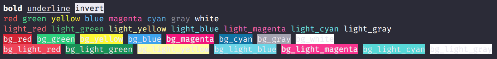

<div align="center">
  
</div>

> Composable and simple terminal highlighting package for OCaml


## Usage

```
$ opam install chalk
```

```ocaml
let some_string = "Hello world!"
  |> Chalk.red
  |> Chalk.bold
  |> Chalk.underline
```

## License

This software is free to use under the MIT License. See [this reference](https://opensource.org/licenses/MIT) for license text and copyright information.
